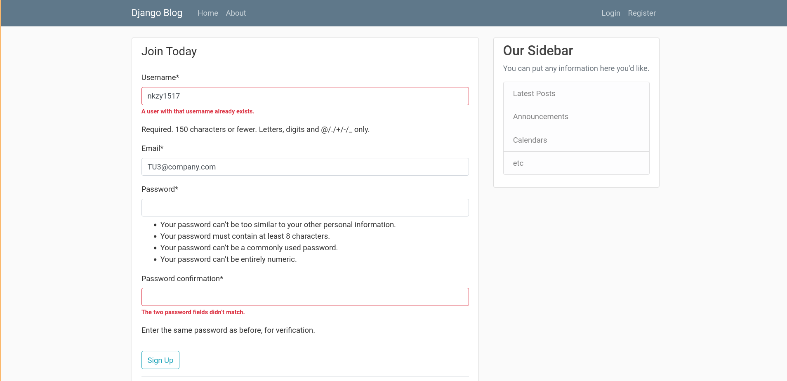

# Part 1
Goal is to create a blog style website, with an authentication system.

## Creating a new project
See Mosh tutorial notes

# Part 2 Application and Routes

## Create new app
See Mosh tutorial notes

Inside your `view.py` import http response. 

```python
from django.http import HttpResponse
```

Create a view function that returns home page. 

```python
# blog/views.py
def home(request):
    return HttpResponse('<h1> Blog Home </h1>')
```

Map a url to your view function
* Create `url.py` file inside `blog` app. Add the following lines of code inside. 

```python
from django.urls import path
from .views import home

urlpatterns = [
    # Empty path - Home page
    path('',views.home, name='blog-home'),
]
```

Inside the project `url.py` file, import include method as well, which is from django.url

```python
# django_project/urls.py
from django.contrib import admin
from django.urls import path, include

urlpatterns = [
    path('admin/', admin.site.urls),
    path('blog/', include('blog.urls'))
]

```
When the user navigates to some URL, the code will look through the `urlpatterns` list inside `django_project/urls.py`. Checks if there is a pattern that matches that. Then it asks, where next should I send people if they are at this URL. For example if you land on `blog/`, it will look within the `url.py` file of that particular app. For example

```python
"""
Whenever Django sees this include function, it will chop off
whatever URL it has seen up to that point, and send the 
remaining string into the urls module for futher processing. 

In this case, the user goes to blog url, but when you chop that off
there is nothing reminaing so it's just an empty string. 
"""
include('blog.urls'),
```

Which in our case an empty string for the blog's urlpatterns returns the `home` function in our `blog/views.py` file.

```python
urlpatterns = [
    # Empty path - Home page
    path('', views.home, name='blog-home'),
]
```

Summarised: User nagivates to URL, sent to project URLpatterns, sent to app url patterns, sent to the correct view function to handle the request.

# Part 3 Templates

## Creating templates
For each app, Django will look for a templates subdirectory by default. 

Create another subfolder within `blog/templates` named after the app name `blog`. Corey (paraphrase mine): "This sounds redundant, but it's just part of the Django convention."

blog -> templates -> blog -> templates.html

Corey says to add the `BlogConfig` within `blog/apps.py` inside you `INSTALLED_APPS` list inside the `settings.py` file of your project folder. As such

```python
# settings.py

INSTALLED_APPS = [
    'django.contrib.admin',
    'django.contrib.auth',
    'django.contrib.contenttypes',
    'django.contrib.sessions',
    'django.contrib.messages',
    'django.contrib.staticfiles',
    'blog.apps.BlogConfig', # <- added new app
]
```

Now, in your view function file `views.py`, change the return of your view function to render the template html file instead of the HttpResponse.

Remarks: The first argument of render is always request. Second is the filepath to the template html file.


Adding dummy data into our views function, i.e. fake posts.

1. To do so create some dummy blog posts called posts.
2. Use the context parameter, enter in a dictionary defined within your view function.
3. Change your template file, i.e. `home.html`. Write a for loop to show posts.
Remark: Use `` for for-loops, `{{}}` for variables in a HTML file.


4. We can also use 'if/else' statements.

```html

    <title></title>

    <title></title>

```

## Templates inheritance
Reduce repeated code for html.

We can create a base template, and replace the custom html sections with blocks. Then the child template can override the the parent base template. 

```html
 
```
Then in your child templates, remove everything that isn't unique to the template. 


*New `home.html`*

```html



    
     print post info, one at a time 
        <h1>{{  post.title  }}</h1>
        <p> By {{ post.author }} on {{post.date_posted}}</p>
        <p> {{post.content}} </p>
    


```

*New `about.html`* 

```html

    
    
        <h1>About Page</h1>
    

```

Summary: Template inheritance makes it easier to apply changes across multiple pages in the site. For example, if you wanna use "bootstrap"...Look into it.

## Bootstrap

[Bootstrap starter template](https://getbootstrap.com/docs/4.0/getting-started/introduction/#starter-template)

```html
<!doctype html>
<html lang="en">
  <head>
    <!-- Required meta tags -->
    <meta charset="utf-8">
    <meta name="viewport" content="width=device-width, initial-scale=1, shrink-to-fit=no">

    <!-- Bootstrap CSS -->
    <link rel="stylesheet" href="https://cdn.jsdelivr.net/npm/bootstrap@4.0.0/dist/css/bootstrap.min.css" integrity="sha384-Gn5384xqQ1aoWXA+058RXPxPg6fy4IWvTNh0E263XmFcJlSAwiGgFAW/dAiS6JXm" crossorigin="anonymous">

    <title>Hello, world!</title>
  </head>
  <body>
    <h1>Hello, world!</h1>

    <!-- Optional JavaScript -->
    <!-- jQuery first, then Popper.js, then Bootstrap JS -->
    <script src="https://code.jquery.com/jquery-3.2.1.slim.min.js" integrity="sha384-KJ3o2DKtIkvYIK3UENzmM7KCkRr/rE9/Qpg6aAZGJwFDMVNA/GpGFF93hXpG5KkN" crossorigin="anonymous"></script>
    <script src="https://cdn.jsdelivr.net/npm/popper.js@1.12.9/dist/umd/popper.min.js" integrity="sha384-ApNbgh9B+Y1QKtv3Rn7W3mgPxhU9K/ScQsAP7hUibX39j7fakFPskvXusvfa0b4Q" crossorigin="anonymous"></script>
    <script src="https://cdn.jsdelivr.net/npm/bootstrap@4.0.0/dist/js/bootstrap.min.js" integrity="sha384-JZR6Spejh4U02d8jOt6vLEHfe/JQGiRRSQQxSfFWpi1MquVdAyjUar5+76PVCmYl" crossorigin="anonymous"></script>
  </body>
</html>
```

^From the bootstrap boilerplate above, we extract the code with the comments "Bootstrap CSS"  and "Optional Javascript".

```html
<!DOCTYPE html>
<html>
    <head>
        <!-- Required meta tags -->
        <meta charset="utf-8">
        <meta name="viewport" content="width=device-width, initial-scale=1, shrink-to-fit=no">

        <!-- Bootstrap CSS -->
        <link rel="stylesheet" href="https://cdn.jsdelivr.net/npm/bootstrap@4.0.0/dist/css/bootstrap.min.css" integrity="sha384-Gn5384xqQ1aoWXA+058RXPxPg6fy4IWvTNh0E263XmFcJlSAwiGgFAW/dAiS6JXm" crossorigin="anonymous">

        
        <title>Django Blog - {{ title }} </title>
        
            <title>Django Blog</title>
        
    </head>
    <body>
        <div class="container">
             
        </div>
        <!-- Optional JavaScript -->
        <!-- jQuery first, then Popper.js, then Bootstrap JS -->
        <script src="https://code.jquery.com/jquery-3.2.1.slim.min.js" integrity="sha384-KJ3o2DKtIkvYIK3UENzmM7KCkRr/rE9/Qpg6aAZGJwFDMVNA/GpGFF93hXpG5KkN" crossorigin="anonymous"></script>
        <script src="https://cdn.jsdelivr.net/npm/popper.js@1.12.9/dist/umd/popper.min.js" integrity="sha384-ApNbgh9B+Y1QKtv3Rn7W3mgPxhU9K/ScQsAP7hUibX39j7fakFPskvXusvfa0b4Q" crossorigin="anonymous"></script>
        <script src="https://cdn.jsdelivr.net/npm/bootstrap@4.0.0/dist/js/bootstrap.min.js" integrity="sha384-JZR6Spejh4U02d8jOt6vLEHfe/JQGiRRSQQxSfFWpi1MquVdAyjUar5+76PVCmYl" crossorigin="anonymous"></script>
    </body>
</html>
```
Adding the container class gives some padding to the blog post.

Key point here is about template inheritance, to make scalable code and to add some CSS to make template look nicer, not just base html.

Part 3: Templates; Timestamp 33:07

Copy code from Corey's repo, in a file called `navigation.html`. We are trying to add in some navigation features to the website. 

Right as he was explaining how to add CSS to our website, he begins to talk about creating a new directory to store CSS. Usually the folder is called `static`. 

* Create a new folder in the `blog` directory and create a new folder `static`.
* Create another folder inside your `static` folder, name it after the app.
  * ie. Your folder structure: blog -> static -> blog 
* Create a new file called `main.css` inside the lowest subfolder. Copy and paste the code from the snippets folder, there's a file with the same name `main.css`.
* Insert a code block at the top of your `base.html` file to load your custom css file.


This is what you see when you refresh the server.


Part 3 Timestamp 39:51, replace the article html with code snippet file of the same name. The new article html has more CSS classes to make the article looks nicer.


We want to abstract the href arguments in our `base.html` file so that we don't hard code
the links in the navigation bar.

Previously:
```html
<a class="nav-item nav-link" href="/">Home</a>
```

Now (making use of a code block): 
```html
<a class="nav-item nav-link" href="">Home</a>
```

We use the url tag and the name of the route, which we chose to be 'blog-home'.

Recap on purpose of templates: Update your site in a single location (template inheritance), use URLS for link references, avoid hardcoding.

## Part 4 Admin Page

* Create new super user to login in as admin to your site.
* Create database (database migration, apply changes to database, for us, will create an auth_user table)
* Run `python manage.py makemigrations`
* Run `python manage.py migrate`
* Open terminal and enter the following command:
* `python manage.py createsuperuser`

## Part 5 Database and Migrations

* Sqlite for development
* Postgres for production

Add the stuff you need in `models.py`
```python
#models.py
from django.db import models
from django.utils import timezone
from django.contrib.auth.models import User

class Post(models.Model):
    #  Create title attribute, a character field with a max length
    title = models.CharField(max_length=100)
    # Create content attribute as a textfield
    content = models.TextField()
    date_posted = models.DateTimeField(default=timezone.now)
    # on_delete removes all the posts if the user is deleted
    author = models.ForeignKey(User, on_delete=models.CASCADE)
```
In your terminal

* Run `python manage.py makemigrations`
* Run `python manage.py sqlmigrate blog <migration_number>`
* Replace the migration_number with 0001.

This is the terminal output you'll see. 


Turns class into SQL commands. Saves time for us to write the SQL ourselves. Object relational mappers makes it possible to write SQL code using on Python objects.

* Run migrate command: `python manage.py migrate`. You should get an OK status.
  
Creating a new post

* Run `python manage.py shell` to go into the Python terminal that can interact with Django objects
* Run `from blog.models import Post`
* Run `from django.contrib.auth.models import User`
* Assign user var to some user, i.e. `user = User.objects.filter(username='nkzy1517').first()`
* `user = User.objects.get(id=1)`
* Create a post instance: `post_1 = Post(title='Blog 1', content='First Post Content!', author=user)`
* Save post: `post_1.save()`
* Check that your post is saved: `Post.objects.all()`
* Creating a post through 
  * Either create another post instance, specifying the author OR
  * Run `user.post_set.create(title='Blog 3', content='Third Post Content!')` and you can leave out the author and the `.save()` method.

Instead of building out posts based on hardcoded dummy data, now we try to get the information from a SQL query to a database. 


*Hardcoded dummy data in `views.py`*

```python
# views.py
# Old code
def home(request):
    context = {
        'posts': posts
    }
    return render(request, template_name='blog/home.html', context=context)
```

```python
# views.py
# New code
def home(request):
    context = {
        'posts': Post.objects.all()
    }
    return render(request, template_name='blog/home.html', context=context)
```
The new code chunk uses the object relational mappers, which turn OOP Python code into SQL queries to the database. Using the `objects.all()` method gives all the posts.

Next we want to have an option to add posts via the admin page, i.e. http://127.0.0.1:8000/admin/. To do that you have to go to your `blog` folder's `admin.py` file

```python
# blog/admin.py
from django.contrib import admin
from .models import Post

admin.site.register(Post)
```

This is reflected in your admin GUI.


# Part 6 - User Registration
Goal: Create a front-end form, the kinds you typically see when you sign up for an account with a new platform.

First, we create an app called `users`. This will handle all our user features, like creating users. To create an app, recall that we run the terminal command:

```
python manage.py startapp users
```

Then we will get a new folder. Now we need to add our newly created `users` app to out settings.py file's `INSTALLED_APPS` list. Question: How do we know what name to add to the list? Well, we can think of the app you want to add as something like an import statement. You begin with the folder, followed by the subfolders, adding a period `.` as you go down the folder levels. Finally you end with the class name of your app. The class name is found in the `apps.py` file.

```python
# users/apps.py
class UsersConfig(AppConfig):
    default_auto_field = 'django.db.models.BigAutoField'
    name = 'users'
```

So now we have 

```python
INSTALLED_APPS = [
    'django.contrib.admin',
    'django.contrib.auth',
    'django.contrib.contenttypes',
    'django.contrib.sessions',
    'django.contrib.messages',
    'django.contrib.staticfiles',
    'blog.apps.BlogConfig',
    'users.apps.UsersConfig', # <- Newly added app file
]
```

Now we write the functions to create forms. Django comes with built-in classes for creating forms.

```python
from django.contrib.auth.forms import UserCreationForm
```

We create a template for this in HTML. Recall that to create a template for an app, we need to create this 'redundant' folder structure:

app_name > templates > app_name > template_name.html

Now instead of creating a `urls` module for our `users` app just as we did for blog, we are going to directly import the views function from the `users` app into the overall project's `urls.py` file.

See the difference between blog and users?

```python
from django.contrib import admin
from django.urls import path, include
from users import views as user_views

urlpatterns = [
    path('admin/', admin.site.urls),
    path('', include('blog.urls')),
    path('register/', user_views.register, name='register'),
]
```

Now we have a basic registration page when we navigate to that URL. 


Now we can make it look a little nicer using the form template. Simple change is to do `{{ form.as_p }}` instead of `{{ form }}`.

Key takeaway: User form gives us this user form all out of the box.

Now we want to handle the POST request that we get after the completed form. To do that, we would like to 

1. Handle the underlying POST
2. Redirect the user to home page and print a message communicating the status of the sign-up, i.e. If it was successful or not.


For (1), we can add a conditional to handle the POST request in the  `users/views.py` file. For (2), we will report a success message and add a highlighted bar at the top of the home-page, right above the posts.

(1)'s code change:

```python
# Create your views here.
def register(request):
    # Add in conditional to handle a POST request, to validate the form data
    if request.method == 'POST':
        form = UserCreationForm(request.POST)
        if form.is_valid():
            # Form passes validation check, get the username and return a message.
            username = form.cleaned_data.get('username')
            messages.success(request, f'Account created for {username}!')
            # After a successful sign-up, use redirect function to
            # send the user back to the homepage.
            return redirect('blog-home')
    else:
        form = UserCreationForm()
    return render(request, 'users/register.html', {'form': form})
```

(2)'s code change, focus being on the if messages block.

```html
-snip-

<div class="row">
    <div class="col-md-8">
    
        
        <div class="alert alert-{{ message.tags}}"> 
            {{ message }}
        </div>
          
    
    
    </div>
    <div class="col-md-4">
    <div class="content-section">
        <h3>Our Sidebar</h3>

-snip-
```


Finally, to update your database after a successful signup, just add `form.save()` to your views function.


## Adding a new field to the user creation form
Notice that we are missing the email address field for our alicebob. Now we need to create a new field to add to our register template.

To resolve this, we create a custom registration form using Django's default form template. Essentially, this we make a child class from Django's `UserCreationForm` class. After that we need to replace the default form we used in the views function to our custom form class, which we call `UserRegisterForm`, which now includes an email field.

```python
# django_project/users/forms.py
from django import forms
from django.contrib.auth.models import User
from django.contrib.auth.forms import UserCreationForm

# Create a form that inherits from UserCreationForm

class UserRegisterForm(UserCreationForm):
    email = forms.EmailField(required=True)

    class Meta:
        # The model that is affected is the User model
        model = User
        # These are fields we want in the form, in this order
        fields = ['username', 'email', 'password1', 'password2']
```
Voila


So let's try again, to add a new user, this time with an email address...


## Add bootstrap style to registration page to match our homepage style

Plus we want to add a highlight message to tell the user that they entered something wrong in one of the fields.

Let's try to do all our styling in our templates. C.S introduces a third-party Django framework called CrispyForms.

So we install it with `pip install django-crispy-forms`.

Add it to your settings file's `INSTALLED_APPS`:

```python
-snip-
INSTALLED_APPS = [
    'django.contrib.admin',
    'django.contrib.auth',
    'django.contrib.contenttypes',
    'django.contrib.sessions',
    'django.contrib.messages',
    'django.contrib.staticfiles',
    'blog.apps.BlogConfig',
    'users.apps.UsersConfig',
    'crispy_forms', # <- added crispy forms
]
-snip-

.
.
.
# Specify which CSS framework you wanna use, in our case, bootstrap 4
CRISPY_TEMPLATE_PACK = 'bootstrap4'
```

Then go back to your `register.html` template and load the Crispy Form in a code block and add a filter (denoted by `|`) on the `forms` variable.

```html



    <div class="content-section">
        <form method="POST">

-snip-
.
.
.
            <fieldset class="form-group">
                <legend class="border-bottom mb-4"> Join Today </legend>
                {{ form|crispy }}
            </fieldset>
-snip-
```



We can see that the both the spacing of the fields and the error messages look so much better.

Stopped at beginning of Part 7.